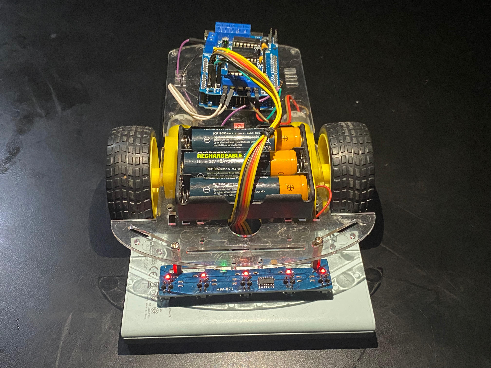

# 🤖 Robot Line Follower dengan Arduino Uno dan Sensor TCRT5000 (5 Channel) 
Proyek ini merupakan implementasi dari robot line follower menggunakan Arduino Uno dan 5 channel sensor TCRT5000. Robot ini mampu mengikuti garis hitam di atas permukaan putih dengan akurasi yang cukup tinggi berkat penggunaan multiple channel IR sensor yang memberikan pembacaan lebih detail terhadap posisi garis.

#✨Fitur Utama 
1. Menggunakan Arduino Uno sebagai mikrokontroler utama.
2. 5 channel TCRT5000 IR sensor untuk deteksi posisi garis.
3. Algoritma dasar line following
4. Output kontrol ke dua motor DC melalui motor driver L298D.
5. Kemampuan untuk mengikuti belokan kiri/kanan dan menyesuaikan kecepatan motor sesuai kondisi garis. 

## 🧰 Komponen Yang Digunakan 
1. Arduino Uno
2. Sensor TCRT5000 (5 channel)
3. Motor Driver L298D
4. Motor DC + roda
5. Power supply (baterai 7.4V atau 9V)
6. Kabel jumper
7. Rangka Robot

## 🖥️ Tampilan Robot Line Follower 
Tampilan Robot line Follower

